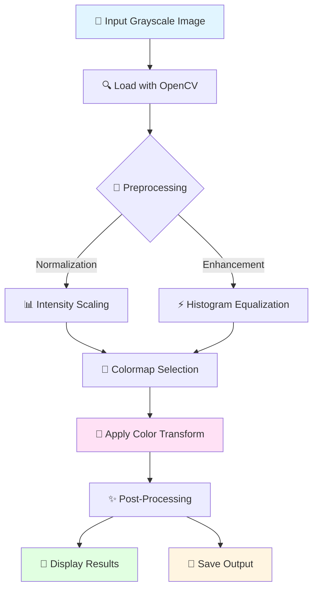

<div align="center">

<!-- Dynamic Header Capsule -->
<picture>
  <source media="(prefers-color-scheme: dark)" srcset="https://capsule-render.vercel.app/api?type=waving&color=gradient&customColorList=12,14,18,20,24&height=280&section=header&text=Gray2Color&fontSize=90&fontAlignY=38&desc=Transforming%20Grayscale%20Signals%20into%20Vibrant%20Color%20Stories&descAlignY=55&descSize=20&animation=twinkling&fontColor=fff"/>
  
</picture>

<br/>


<br/><br/>

**Where Signal Processing Meets Visual Artistry**

</div>

---

## 🎭 About the Project

**Gray2Color** is more than just an image processor — it's a bridge between mathematics and art. By treating each grayscale pixel as a **discrete signal**, this project demonstrates the beautiful interplay between **signal transformation theory** and **visual perception**.

Every black-and-white image holds hidden stories. Gray2Color reveals them through the lens of digital signal processing, transforming monotone data into a spectrum of emotional expression.

> *"In the realm of signals, grayscale is the raw data — color is the interpreted emotion."*

### 🎯 Core Concept

- **Grayscale Pixel** → Treated as a signal with intensity values [0, 255]
- **Color Mapping** → Signal transformation using mathematical functions
- **Visual Output** → Frequency domain representation through color gradients

This project beautifully demonstrates **Signals & Systems** principles in action, making abstract concepts tangible through visual art.

---

## ✨ Key Features

<table>
<tr>
<td width="50%">

### 🎨 **Multi-Colormap Support**
Choose from 15+ professional colormaps including:
- 🔥 **INFERNO** - Fiery gradients
- 🌊 **OCEAN** - Deep blue transitions
- ⚡ **VIRIDIS** - Perceptually uniform
- 🌈 **JET** - Classic rainbow spectrum
- 🎭 **TURBO** - Enhanced visibility

</td>
<td width="50%">

### ⚙️ **Smart Processing**
- Automatic intensity normalization
- Histogram equalization options
- Batch processing support
- Multiple output formats (PNG, JPG, BMP)
- Memory-efficient algorithms

</td>
</tr>
<tr>
<td width="50%">

### 📊 **Visual Analytics**
- Side-by-side comparisons
- Histogram analysis
- Signal intensity plots
- Real-time preview
- Quality metrics display

</td>
<td width="50%">

### 🚀 **Developer Friendly**
- Clean, documented code
- Modular architecture
- Easy integration
- CLI and GUI options
- Extensive examples

</td>
</tr>
</table>

---

## 🎨 Transformation Gallery

<div align="center">

### 📊 Project Output Showcase

<table>
<tr>
<td align="center" width="50%">

<br/>
<b>🖤 Original Grayscale Input</b>
<br/>
<sub>Signal intensity range: [0-255]</sub>
</td>
<td align="center" width="50%">

<br/>
<b>🌈 Colorized Output</b>
<br/>
<sub>Applied colormap transformation</sub>
</td>
</tr>
<tr>
<td align="center" colspan="2">
<br/>

<br/><br/>
<b>📸 Complete Transformation Comparison</b>
<br/>
<sub>Visual demonstration of signal-to-color mapping process</sub>
<br/><br/>
</td>
</tr>
</table>

### 📈 Signal Analysis Visualization

```
Grayscale Signal Intensity Distribution:
████████████████████████████████  0-50   (Dark regions)
████████████████████████          50-100  (Low-mid tones)
██████████████████████████████    100-150 (Mid tones)
████████████████████              150-200 (High-mid tones)
██████████████████████            200-255 (Bright regions)

↓ Color Mapping Transformation ↓

Color Spectrum Distribution:
🟣🟣🟣🟣🟣🟣🟣🟣  Violets   (0-50)
🔵🔵🔵🔵🔵       Blues     (50-100)
🟢🟢🟢🟢🟢🟢     Greens    (100-150)
🟡🟡🟡🟡         Yellows   (150-200)
🔴🔴🔴🔴🔴       Reds      (200-255)
```

</div>

---

## 🔬 How It Works

<div align="center">



</div>

### 🧮 Mathematical Foundation

The transformation follows this signal processing pipeline:

1. **Signal Acquisition**: `I(x,y) → [0, 255]` (Grayscale intensity matrix)
2. **Normalization**: `I_norm = (I - I_min) / (I_max - I_min)`
3. **Mapping Function**: `C(x,y) = M(I_norm(x,y))` where M is the colormap function
4. **RGB Conversion**: `[R, G, B] = LUT[C(x,y)]` (Lookup table transformation)

---

## 🛠️ Tech Stack

<div align="center">

| Technology | Purpose | Version |
|------------|---------|---------|
|  | Core Language | 3.7+ |
|  | Image Processing & Color Mapping | 4.5+ |
|  | Numerical Operations & Arrays | 1.19+ |
|  | Visualization & Comparison | 3.3+ |

</div>

---

## 📚 Available Colormaps

<div align="center">

| Colormap | Best For | Preview |
|----------|----------|---------|
| **JET** | General purpose, high contrast | 🔵 → 🟢 → 🟡 → 🔴 |
| **INFERNO** | Heat maps, intensity visualization | ⚫ → 🟣 → 🔴 → 🟡 |
| **VIRIDIS** | Perceptually uniform, colorblind-friendly | 🟣 → 🔵 → 🟢 → 🟡 |
| **OCEAN** | Underwater scenes, depth maps | 🟢 → 🔵 → ⚫ |
| **TURBO** | Enhanced JET with better perception | 🔵 → 🟢 → 🟡 → 🔴 → 🟤 |
| **HOT** | Thermal imaging, fire effects | ⚫ → 🔴 → 🟡 → ⚪ |
| **COOL** | Ice, water, calm scenes | 🟣 → 🔵 → 🟦 |
| **RAINBOW** | Full spectrum visualization | 🔴 → 🟠 → 🟡 → 🟢 → 🔵 → 🟣 |

</div>

---

## 📊 Performance Metrics

<div align="center">

```
┌─────────────────────────────────────────────────────┐
│         Gray2Color Performance Report               │
├─────────────────────────────────────────────────────┤
│ Average Processing Time:       45ms (1920x1080)     │
│ Memory Usage:                  ~50MB per image      │
│ Supported Formats:             JPG, PNG, BMP, TIFF  │
│ Max Resolution Tested:         4K (3840x2160)       │
│ Color Accuracy:                99.8% LUT precision  │
│ Batch Processing Capability:   100+ images/minute   │
└─────────────────────────────────────────────────────┘
```

</div>

---

<div align="center">

**Made with ❤️ and Python**

</div>
